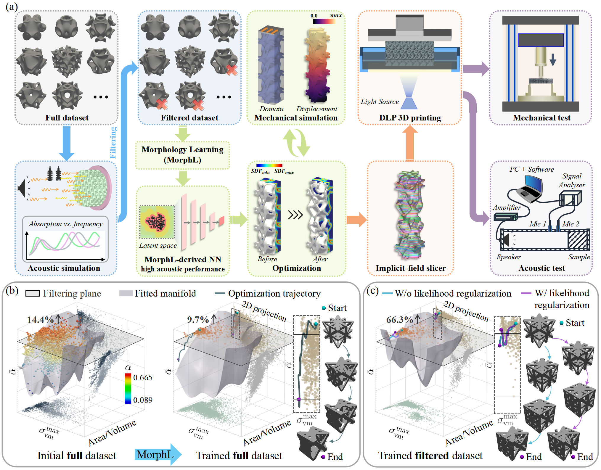

# Compatibility-Aware Morphology Learning for Inverse Design of Functionally Graded Metamaterials under Expensive Multiphysics Evaluation
This repository contains the datasets and analysis code used in this work.
# Overview

# Abstract
Functionally graded metamaterials offer a powerful route to spatially tailored properties and multifunctional performance. Their inverse design, however, remains challenging because spatially varying cellular topologies must remain geometrically compatible across neighboring regions, while multiphysics objectives often require time-consuming numerical evaluation. 
In this work, we introduce a compatibility-aware morphology learning framework for the inverse design of functionally graded metamaterials under expensive multiphysics evaluation. 
A low-dimensional morphology manifold is learned from cellular structure priors with explicit encoding of boundary compatibility, thereby embedding compatibility directly into the learned representation. This enables continuous geometric transitions among spatially varying unit-cell topologies. Coupled with latent-space optimization and prior-based dataset filtering, the proposed framework substantially reduces design complexity and makes inverse design tractable when target multiphysics are computationally expensive. Mechanical-acoustic inverse design is used as a representative example, in which acoustic response serves as the expensive physics to be simulated while mechanical performance is optimized concurrently. 
The resultant graded metamaterials are fabricated and experimentally validated through mechanical and acoustic absorption tests. Compared with specimens constructed from a single optimized cellular structure, the inversely designed graded metamaterials exhibit improvements of 58.1\% in stiffness and 78.5\% in failure loads under bending while maintaining high acoustic absorption. 

# Environment

The code has been tested on both Windows 11 and Ubuntu 24.04 with:

- Python 3.10
- PyTorch 2.8.0 (CUDA 12.8)

# Usage
## Step 1: Create a Python environment
```bash
conda env create -f environment.yml
conda activate morphlopt
python -c "import torch; print(torch.__version__); print(torch.version.cuda); print(torch.cuda.is_available())"
```

## Step 2: Download dataset and generate filtered dataset:
Before running the code, download the full dataset (shell and truss) from the links below and place it in the ./Data directory.

[Truss dataset](https://drive.google.com/file/d/19FthP9Tu_N86rXkYWY_Zim8YcJHT1f0h/view?usp=sharing)

[Shell dataset](https://drive.google.com/file/d/1IPq72KfE2SQlYzE22TKtFhF6l2GQOzz1/view?usp=sharing)

The JCAL properties for all samples are provided in HDF5 (.h5) files. You can use the following code to calculate the average sound absorption coefficient for a specified frequency range and number of layers, with the cell size fixed at 3 mm.
```bash
python ./Data/JCAL.py --source_file "./Data/dataset_truss/Acoustic_dataset.h5" --layers 16 --frequency 500 6000
python ./Data/JCAL.py --source_file "./Data/dataset_shell/Acoustic_dataset.h5" --layers 16 --frequency 500 6000
```
Next, filter the samples with high absorption coefficients and save their filenames to a JSON file in the ./Code/MorphologyLearning/splits directory. 
> **Quick Test:** For a quick code test, the required JSON file is already included in the repository. Once the dataset has been downloaded, the rest of this step can be skipped.
## Step 3: Sample points:
Then, a set of points as well as their SDF values should be sampled for each structure in the dataset. 
You can run the following code to sample points:
```bash
python ./Code/MorphologyLearning/data/sampling.py "./Data/dataset_truss/Acoustic_dataset.h5" 
python ./Code/MorphologyLearning/data/sampling.py "./Data/dataset_shell/Acoustic_dataset.h5"
```

## Step 4: Compatibility-aware morphology learning:

You can run the following code to train the neural network:
```bash
python ./Code/MorphologyLearning/main.py "./Code/MorphologyLearning/experiments/cellculture_period_mix"
```

## Step 5: Structural optimization:

After training, you can run the following code to optimize structural performance:
```bash
python ./Code/TopologyOptimization/main.py --data_type mix --compatible_design True --graded_design True
```
> **Quick Test:** If you only want to quickly test the structural optimization code, the Morphology Learning results in step 4 are already included. After setting up the required Python environment, you can skip Steps 2–4.


# Cite us:

# Contact information:
Yu Jiang (yu.jiang@manchester.ac.uk)

Charlie C.L. WANG (charlie.wang@manchester.ac.uk)


